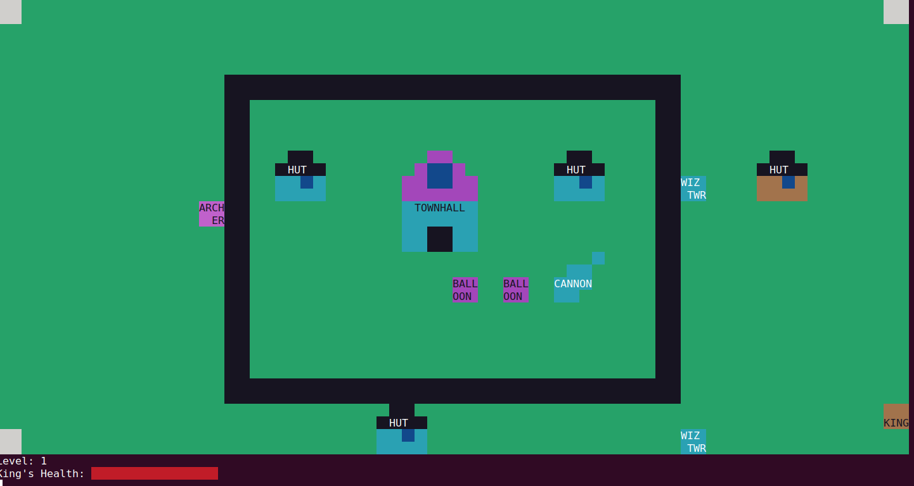

# Clash Of Clans
- A Terminal Based Minified Version of the Game Clash Of Clans.

## Features

- To run the game : ```python3 game.py```
- To view replays : ```python3 replay.py```  and select the replay you want to watch according to mentioned date and time.
- For Victory : All buildings apart from walls get destroyed from the map in all three levels.
- For Defeat : If all troops and King die before destroying all buildings apart from walls.

## Controls :

### King/Queen :

- <kbd>w</kbd> : move up
- <kbd>a</kbd> : move left
- <kbd>d</kbd> : move right
- <kbd>s</kbd> : move down
- <kbd>1</kbd> : Special Attack
- <kbd>space</kbd> : Normal Attack

### Barbarian :

- <kbd>z</kbd> : spawn at point 1
- <kbd>x</kbd> : spawn at point 2
- <kbd>c</kbd> : spawn at point 3

### Dragon :

- <kbd>v</kbd> : spawn at point 1
- <kbd>b</kbd> : spawn at point 2
- <kbd>n</kbd> : spawn at point 3

### Archer :

- <kbd>i</kbd> : spawn at point 1
- <kbd>o</kbd> : spawn at point 2
- <kbd>p</kbd> : spawn at point 3

### Balloon :

- <kbd>j</kbd> : spawn at point 1
- <kbd>k</kbd> : spawn at point 2
- <kbd>l</kbd> : spawn at point 3

### StealthArcher:

- <kbd>2</kbd> : spawn at point 1
- <kbd>3</kbd> : spawn at point 2
- <kbd>4</kbd> : spawn at point 3


### Healer :

- <kbd>5</kbd> : spawn at point 1
- <kbd>6</kbd> : spawn at point 2
- <kbd>7</kbd> : spawn at point 3

### Spells : 
- <kbd>r</kbd> : rage spell
- <kbd>h</kbd> : heal spell

q : Quit Game

